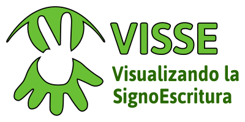

# VisSE App

The [VisSE project](https://www.ucm.es/visse) aims to develop tools that ease
the use and understanding of [SignWriting](https://signwriting.org/) in the
digital world. SignWriting is a system for visually transcribing sign languages
into a 2D page, i.e. a writing system for sign languages.

This webapp is an application of the research and development of the project,
putting the different components together into a user-facing component. The user
can see the different symbols contained in a SignWriting transcription, their
meaning, and 3D representation of the orientation and finger configuration of
the hands.

- A demo can be seen here: [https://holstein.fdi.ucm.es/visse](https://holstein.fdi.ucm.es/visse)

## Research

Underlying the functionality of this app is an expert system, described here.
(TODO add publication). Some of the components are also available publicly:

- [Quevedo](https://github.com/agarsev/quevedo) is the machine learning and
    dataset organization component that makes the expert system possible.
- The annotated data collected by our research and used for the descriptive
    schema of SignWriting and training the algorithms is here (TODO publish).

## Acknowledgements

This app is part of the project "Visualizando la SignoEscritura" (Visualizing
SignWriting), reference number PR2014_19/01, developed in the Faculty of
Computer Science of Universidad Complutense de Madrid, and funded by Indra and
Fundación Universia in the IV call for funding aid for research projects with
application to the development of accessible technologies.

We want to acknowledge the collaboration of the signing community, especially
the Spanish Sign Language teachers at Idiomas Complutense and Fundación CNSE.

## License

The VisSE web app is licensed under the [Open Software License version
3.0](https://opensource.org/licenses/OSL-3.0).

## Team

- [Antonio F. G. Sevilla](https://github.com/agarsev) <afgs@ucm.es>
- [Alberto Díaz Esteban](https://www.ucm.es/directorio?id=20069)
- [Jose María Lahoz-Bengoechea](https://ucm.es/lengespyteoliter/cv-lahoz-bengoechea-jose-maria)
